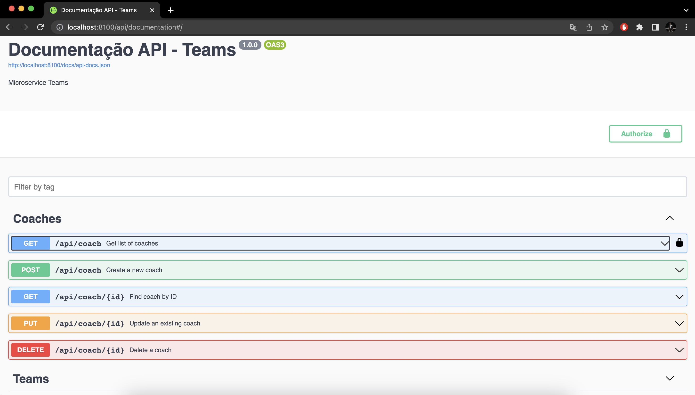

# ludus_service_teams
Microserviço do projeto de aplicativo de futebol para prover os recursos de dados dos times existentes em um campeonato.

## Requisitos
- Docker

## Como rodar o projeto?
1. Clone esse projeto via SSH (`git clone git@github.com:Professor-Dudarts/ludus_service_teams.git`)
2. Execute `docker-compose build`
3. Execute `docker-compose up -d`
4. Execute `php artisan migrate` para gerar as tabelas do MySQL
5. Execute `php artisan tinker`
6. Execute `Coach::factory()->count(10)->create();` e `Team::factory()->count(10)->create();` para gerar registros aleatóriamente

**Nota:** o servidor `MySQL` está utilizando a porta **9906** e o servidor `PHP` a porta **8100** do seu computador, certifique-se que essas portas não estão sendo usadas.

## Como utilizar a API?

**Bem simples, não? 😎**

# Diagrama de classes

# Arquitetura do microserviço

